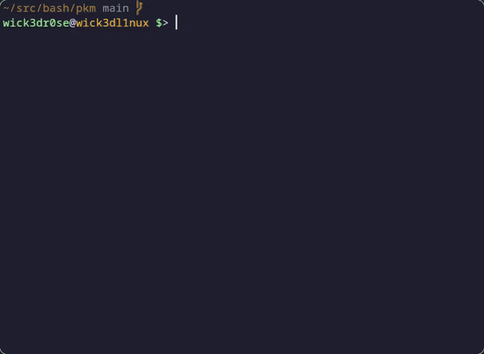

<div align="center">
<h1>pkm</h1>
<p>A super minimal TUI package manager wrapper written in BASH v4.2+</p>
<p><code>pkm</code> is a new project and so far just supports the aptitude package manager</p>


<br>
<br>
<br>

</div>

## Install
```ocaml
$ git clone https://github.com/wick3dr0se/pkm && cd pkm
```

## Usage
```bash
$ pkm
# or if it's installed to path
$ pkm
```

## Controls
H, ←   ...   Back  
J, ↓   ...   Move down  
K, ↑   ...   Move up  
L, →   ...   Do action

Q   ...   Quit
